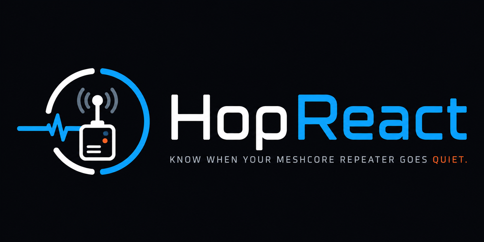

<p align="center">
  
</p>

# HopReact

Sign in with Discord, mark which repeaters and observers are yours, choose what
counts as trouble — no adverts for a day, no messages for six hours, whatever
matters to you — and HopReact's bot sends you a direct message when one goes
quiet.

It reads a public [CoreScope](https://github.com/Kpa-clawbot/CoreScope)
instance — the same data behind
[HopReach](https://github.com/A13xB0/hopreach)'s coverage map — and does
nothing but watch it on your behalf.

> ⚠️ **Vibe-coded software.** This was built with heavy AI assistance rather
> than fully by hand. It is tested — the alerting logic in particular is
> covered fairly thoroughly, because the failure mode is messaging real people
> at three in the morning — and human review has been endeavoured throughout,
> but it has not had independent code review from someone who wasn't also
> steering the AI. Read the source yourself before relying on it for anything
> that matters, and treat the alerts as a helpful nudge rather than a
> guarantee.

## Why

On a real mesh, a dead repeater is easy to miss. On the network this was
built for, **448 of 660 repeaters had not been heard in over 24 hours** — one
more going quiet disappears into the noise. Nobody is watching your node for
you.

## No personal data

Discord is used for **both** sign-in and delivery, which means HopReact never
asks for an email address and never stores a password. It keeps your Discord
user ID and display name, and the OAuth token is discarded once you're signed
in.

## How it decides something is offline

You set **rules**, and each node can have as many as you like. A rule is just
"tell me if there's been no *this* for *that* many hours". They work
independently, so you might say *no adverts for 24 hours* **and** *no messages,
responses or acks for 6*. If several trip at once you still get one message.

You can be as broad or as narrow as you want:

- **Particular kinds of traffic** — adverts, channel messages, responses,
  acknowledgements and the rest, individually or by group. This is how you say
  "I don't care about requests": leave them unticked. A repeater that still
  adverts happily while carrying nobody's messages is exactly the failure this
  catches, and the blunter options below can't see it.
- **Not heard at all** — nothing whatsoever from the node, using CoreScope's
  own figure.
- **Stopped passing traffic** — still alive, but no longer forwarding.

New nodes start with adverts, responses and channel messages, plus a
not-heard-at-all backstop. Observers are watched on whether they are still
reporting packets.

Every node also gets a table of what each kind of traffic was last seen doing,
so you can look before you decide what to alert on.

### What we can and can't tell you

Worth being straight about, because the interface would otherwise imply more
than it knows.

Only **adverts** carry their sender's identity. Every other kind of packet is
encrypted and identifies its sender with a single byte — which, across the ~780
nodes on this mesh, narrows it to about three. So HopReact can tell you what a
node **passed on**, and what it **advertised**, but never what it *sent*.

A node is identifiable in a route only when that route uses hashes of three
bytes or more. Three bytes is unique across every node on the mesh; one byte
matches up to eight, so those hops are discarded rather than guessed at. That
costs coverage — roughly four packets in ten carry usable evidence — and the
trade is deliberate: a confident wrong attribution would mark a dead node alive
and silently disarm the alert you were relying on.

Because of that, **a rule with no evidence behind it stays quiet** rather than
treating a gap in what we can see as proof your node is down.

Alerts are deliberately quiet: one message when something goes down, one when
it comes back, and nothing in between — no matter how long it stays down.

## Status

Running in production at
[scotmesh-alerts.mm7roq.compute.oarc.uk](https://scotmesh-alerts.mm7roq.compute.oarc.uk).
Sign-in, watches, per-type rules, polling, the alert engine and Discord
delivery are all in place and tested.

## Quick start

```bash
git clone https://github.com/A13xB0/hopreact.git
cd hopreact
cp config.example.yaml config.yaml   # add your Discord app credentials
docker compose up --build
```

`config.example.yaml` documents every setting inline. Without Discord
credentials the service still starts and polls — you just can't sign in or
receive alerts, which is a deliberately useful state for looking around
first.

## What it does about noise

An alerting tool that cries wolf gets muted, and a muted tool is worthless.
So:

- **One message down, one message up.** A node offline for a week is one
  message, not one every five minutes.
- **Crossings must be confirmed.** A node hovering at your threshold doesn't
  produce a stream of up/down messages.
- **Nothing for something already broken.** Watch a node that's already quiet
  and you get no alert — and no "recovered" message later either, because you
  were never told it was down.
- **Never alerts on a node that has never relayed.** 189 of the repeaters on
  the live network have never appeared in a packet route; they haven't
  *stopped* doing anything.
- **Never alerts on a rule with nothing behind it.** If we have never once
  seen the traffic a rule asks about, that rule stays quiet. Not being able
  to see something is not the same as it having stopped.
- **Several rules, one message.** Three rules tripping on one node in the same
  check is one DM with three reasons, not three DMs.
- **Silence during our own outages.** If the upstream feed fails, returns
  implausibly little, or freezes, HopReact evaluates nothing rather than
  telling everyone their whole network died. And if a single poll would put
  an implausible number of watches into alert at once, a breaker withholds
  the lot and tells the operator instead.

You will need a Discord application (client ID/secret, a bot token, and a
guild for the bot to live in). A bot can only DM someone it shares a server
with, so signing in adds you to that server — that is what the `guilds.join`
permission on the consent screen is for.

## License

[AGPL-3.0](https://www.gnu.org/licenses/agpl-3.0.html) plus the
[Commons Clause](https://commonsclause.com/) — see [`LICENSE`](LICENSE). In
short: use, copy and modify freely; if you distribute it or run a modified
version as a network service, publish the corresponding source under the same
license; you may **not** sell it or a service substantially based on it.
Provided free of charge, with no warranty and no support.
